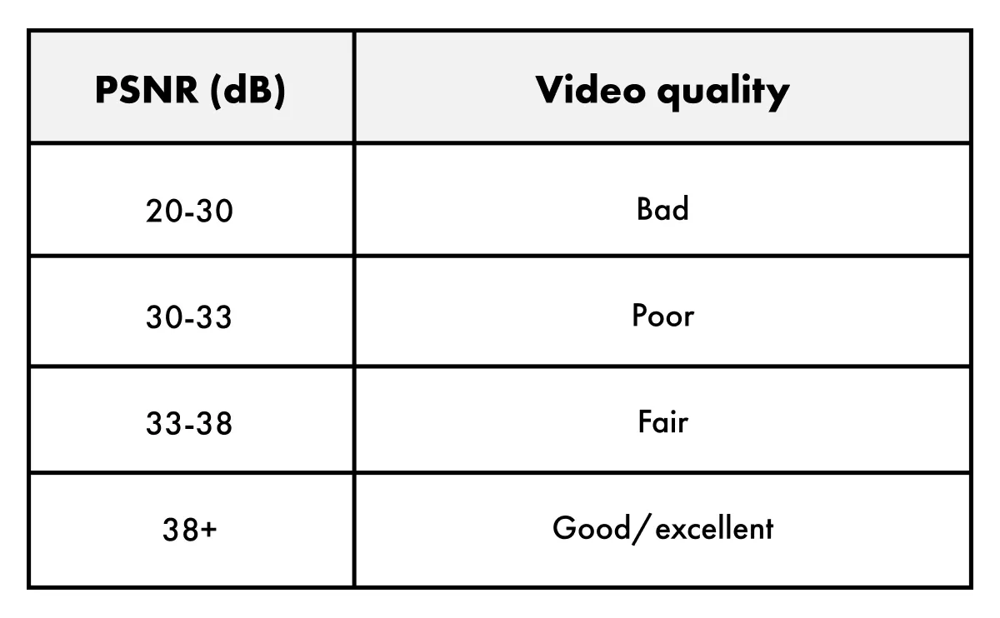
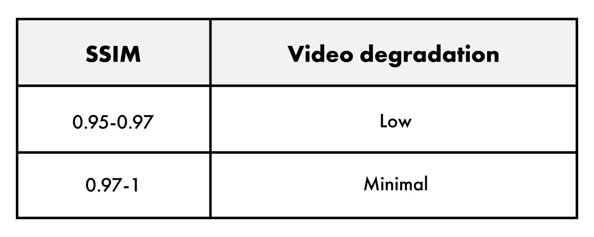
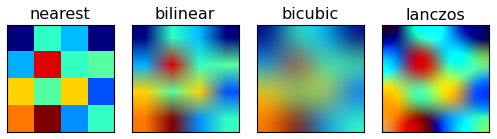
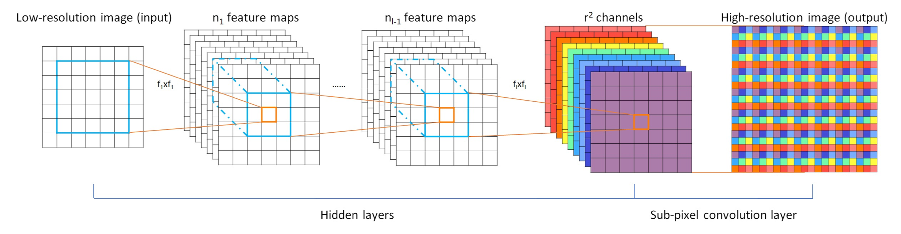
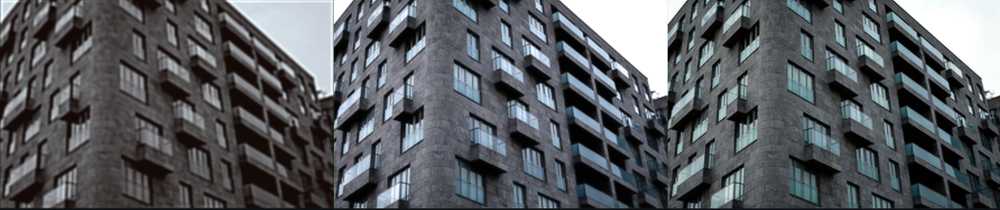
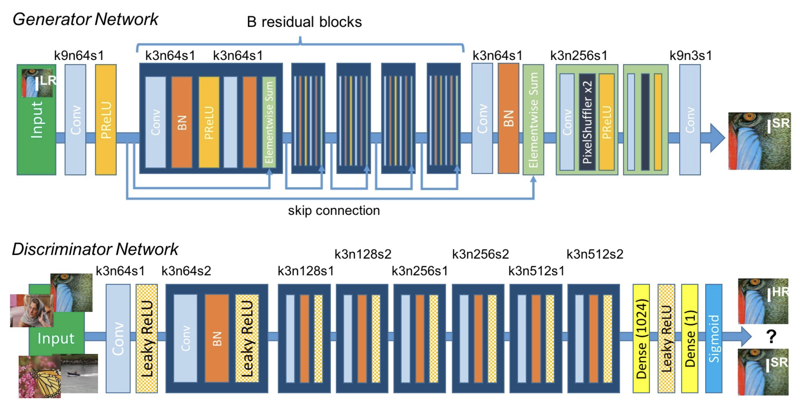
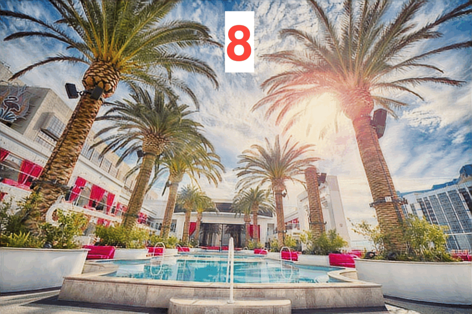

# SingleImageSuperResolution
 

This project will investigate on quality disparitys between different approaches to image super-resolution by using different metrics.  
Super-Resolution is the process of increasing the resolution of an image and therefore the contained information.  

The following approaches will be discussed:
- **Interpolation**
- **CNN** (Convolutional neural networks)
- **GAN** (Generative adversarial networks)
 
 

  

  
  

 
 

## Metrics

The following metrics ase used to determine the quality of the different SR- (Super Resolution) techniques:
- **PSNR** (Peak Signal Noise Ratio)  
  PSNR is a long established image quality metric, most commonly used to compare the compression of different codecs, such as image compression.  

  

  
  

  
  - The **HIGHER** the PSNR, the better the image.   
  
- **SSIM** (Structural Similarity Index Measure)  
  The SSIM compares the luminance, contrast and structure of the original and degraded image. It measures the structural elements of the pixels.
  The SSIM is calculated between 0 and 1, while 1 beeing the best possible value.
  
  

  
  

  - The **HIGHER** the SSIM, the better the image.   
  
- **MSE** (Mean Squared Error)  
  The MSE as the name suggests is an error (between estimation and target) and is therefor to be minimized. The MSE is widely known accross the machine learning scene.   
  
  - The **LOWER** the MSE, the better the image.   
  
- **Laplace-Algorithm** for Sharpness / blurriness  
  The laplacian algorithm can be used as a metric for blurriness in an image, with higher values beeing less blurry.  
  
  - The **HIGHER** the Sharpness, the better the image.
 

[Source: PSNR, SSIM](https://www.testdevlab.com/blog/full-reference-quality-metrics-vmaf-psnr-and-ssim)
 / 
[Source: Laplace](https://medium.com/@sagardhungel/laplacian-and-its-use-in-blur-detection-fbac689f0f88)
 
 

## Interpolation

The first technique for image Super-Resolution is interpolation.  
Standard methods for interpolation are algorithms like:  
- **Bi-Linear** interpolation
- **Nearest neighbot** interpolation
- **Bi-Cubic** interpolation
- **Lanczos** interpolation
 

The following picture show a visual representaion of the operational principle of the specific algorithms: 
[Source](https://matplotlib.org/1.4.2/examples/images_contours_and_fields/interpolation_methods.html)

  

 

### Application:

  

The metrics imply a close race between bicubic and lanczos algorithm. The descision is made in favour of the **LANCZOS**, because here the strengths are more about visual quality than simmilarity to the original image.

So in all following comparisons the **LANCZOS** interpolation algorithm is representative of the interpolation technique.  

A visual comparison between the interpolation algorithms as seen in the picture can be dublicated by the user running the "Interpolation.py" script in the folder [Interpolation](https://github.com/tilllit/SingleImageSuperResolution/tree/main/Interpolation)
 
 

## Dataset (DIV2K)

For training the DIV2k dataset was used, as it contains high resolution images of landscapes, humans, achitecture and more...  
Therefore it should work best on a wide spectrum of applications.

"The DIV2K dataset is one of the most popular datasets used for image super-resolution, which is collected for NTIRE2017 and NTIRE2018 Super-Resolution Challenges. The dataset is composed of 800 images for training, 100 images for validation, and 100 images for testing. Each image has a 2K resolution." - [Medium](https://openmmlab.medium.com/awesome-datasets-for-super-resolution-introduction-and-pre-processing-55f8501f8b18)

### Download:
The dataset can be downloaded from this link: [Kaggle](https://www.kaggle.com/datasets/rain0905/div2k-dataset)
 
 

## SRCNN

### Architectur

The architectur of the SRCNN (Super Resolution Convolutional Neural Network) follows the description of the following papers:
- [Real-Time Single Image and Video Super-Resolution Using an Efficient
Sub-Pixel Convolutional Neural Network](https://arxiv.org/abs/1609.05158)
- [Image Super-Resolution Using Deep
Convolutional Networks](https://arxiv.org/abs/1501.00092)

 

  

The training of a SRCNN that produces higher quality output images can take more than 10^8 epochs and is therefore very time intensive as mentioned in the above papers.  

The results of a medium-range performing network is shown in the following picture (4k epochs):

  

 
As the figure points out, the network produces a better PSNR and SSIM score. The MSE is worse in this case, probably because of the higher stake of learned information. The laplace algorithm rates the network to be more blurry, which is expected to decrease with more epochs of training. See following picture:     

  

[Source](https://github.com/YeongHyeon/Super-Resolution_CNN)
 

### Implementation:
The SRCNN used in this project can be found in the folder [CNN](https://github.com/tilllit/SingleImageSuperResolution/tree/main/CNN)  
It is based on this implementation: [link](https://medium.com/gdplabs/image-super-resolution-in-python-cae6050b13d8)  

For training the user needs to manually add the div2k database.
For testing, a pre-trained model is obtained and the settings should allow to run the script TF.py without any problem.

 
 

## SRGAN

### Architectur

The architectur of the SRGAN (Super Resolution Generative Adversarial Networks) follows the description of the following papers:  

- [Photo-Realistic Single Image Super-Resolution Using a Generative Adversarial Network](https://arxiv.org/abs/1609.04802)
- [ESRGAN: Enhanced Super-Resolution Generative Adversarial Networks](https://arxiv.org/abs/1809.00219)
 

  

To understand the functional principle I recommend watching this [walkthrough video](https://www.youtube.com/watch?v=qwYOlXRdADI)  

The training of the SRGAN can be witnessed in the following GIF file:

  

When having a look at the output picture of the GAN it becomes obvious, that the GAN is superior to the interpolation technique. It is actualy very close to the original, even though the generative aspects are visible. PSNR and sharpness are better than the interpolation. SSIM and MSE are worse, because the generator creates new parts in the image, which share no similaritys with the original.

  

### Implementation
The GAN was also trained on the div2k dataset and is based on the following implementation: [link](https://github.com/AarohiSingla/SRGAN_CustomDataset)  
The SRGAN used in this project can be found in the folder [SRGAN](https://github.com/tilllit/SingleImageSuperResolution/tree/main/SRGAN)  

For training the user needs to manually add the div2k database.
For testing, a pre-trained model is obtained and the settings should allow to run the script main.py without any problem.

 
 

## Evaluation

- To evaluate the project, one can say, that the interpolation method often produces a better score at the metrics, that compare the output picture to the original (especially the MSE).  
- The SRCNN often produces outputs, that are visually more appealing, but for adding learned content, that is not based on the original, the metrics are sometimes worse than the interpolation. It is expected, that the quality of the SRCNN will more often
  surpass the interpolation, the more epochs are used for its training. Since time for this project was limited, this will not be investigated any further.  
- The GAN obviously produces outputs, that are most appealing to the pure eye. Since it generates missing content, it differs more from the original, than one can see. This is filteres by the conventional metrics, comparing the output to the original.
  The sharpness metric, using the laplace-arlgorithm uses a non-comparing principal. It shows in every picture, that the SRGAN produces the sharpest pictures of the three methodes.  

The following examples will visualize this behavior. I find it interesting to see, how the SRGAN interprets the textures of the elements in the picture sometimes.  

### Examples:

 

  

  

  

  

  

  

  

  

  

  

 

## DIY

For everyone, who wants to try these networks, there is a pretrained version, that creates a comparison, as seen in the pictures before in the folder [Comparison](https://github.com/tilllit/SingleImageSuperResolution/tree/main/Comparison).   
You can place any .png image by the name "org.png" in the folder "_test" and start the script Compare.py. The code will create the comparing plot and save the output images in the subfolder "pred".

